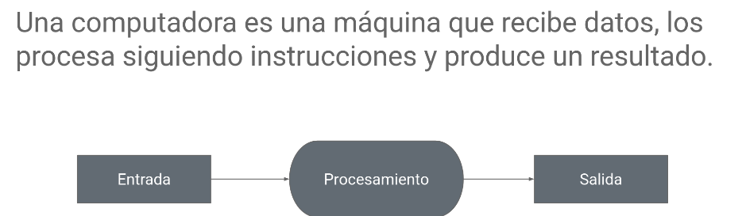

# Clase 1

## Temas de la clase

- Presentación de la materia.
- Computadoras y lenguajes.
- Introducción a Linux y Bash.

## Material (PDF)

- [Clase 1.0 - Presentación](./material/Clase%201.0%20-%20Presentaci%C3%B3n.pdf)
- [Clase 1.1 - Computadoras y lenguajes](./material/Clase%201.1%20Computadoras%20y%20lenguajes.pdf)
- [Clase 1.2 - Introducción a linux y bash](./material/Clase%201.2%20Introducci%C3%B3n%20a%20linux%20y%20bash.pdf)

## Scripts

En la clase hicimos nuestro primer script en Python, completando el ciclo de la definición de computadora: **entrada, procesamiento y salida**.



- Archivo: [`scripts/primer-script.py`](./scripts/primer-script.py)

```python
nombre = input("¿Cual es tu nombre? ") # Entrada
mensaje = "Hola! Bienvenido " + nombre # Procesamiento
print(mensaje) # Salida
```

## Tarea de la clase

1. Crear una cuenta en [GitHub](https://github.com/).
2. Instalar [Visual Studio Code](https://code.visualstudio.com/).
3. Instalar WSL en Windows:
   - Guía oficial: [Instalación de WSL | Microsoft Learn](https://learn.microsoft.com/es-es/windows/wsl/install)
   - Referencia rápida: en PowerShell (como administrador), ejecutar `wsl --install`
4. Una vez instalado WSL o Git Bash, realizar la filimina "Jugando con la terminal Parte de 2" de la [clase 1.2](./material/Clase%201.2%20Introducci%C3%B3n%20a%20linux%20y%20bash.pdf).

## Opción alternativa a WSL

También se puede usar [Git for Windows](https://git-scm.com/download/win), que incluye **Git Bash**.

- Ventaja: instalación más simple y rápida.
- Limitación: no reproduce un entorno Linux completo como WSL.

Para esta materia, **WSL es la opción recomendada** para mantener un entorno más cercano a Linux real y evitar diferencias en comandos/herramientas.  
Si una computadora no soporta WSL o hay problemas de instalación, **Git Bash es una alternativa válida** para comenzar a trabajar con Bash.

## Nota

Si algún enlace no abre desde tu visor, podés navegar manualmente a la carpeta [`material`](./material/).

## Recomendación del profe

Tomar la **chuleta de Bash** y jugar en casa con los comandos.  
La práctica corta y frecuente ayuda mucho a ganar soltura en terminal.
