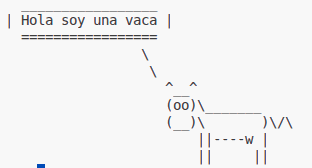

<!-- _class: title -->
<!-- _paginate: false -->

# 14. Volviendo a clases

## Breve recapitulación + Gestión de Ambientes + Sala de Chat

<div class="course">
Programación I<br>
Ingeniería Electrónica y Telecomunicaciones
</div>

<div class="meta">
Comisión 3<br>
Profesor: Lautaro Linquimán<br>
Universidad Nacional de Río Negro
</div>

<div class="unrn-logo">
  
  <span>UNIVERSIDAD<br>NACIONAL</span>
</div>

---

<!-- _class: inverse -->

# Repaso express <br />¿Qué herramienta usamos?

1. Pedir datos hasta escribir “salir”.
2. Recorrer una lista de datos fijos.
3. Una función debe producir un resultado manipulable.
4. Una función debe recibir datos si los necesita.
5. Tenemos que guardar datos que no se repiten.
6. Tenemos que guardar datos que no se pueden modificar.

---

# Analizando un poco de código

<div class="columns">
<div>

```python
registros_temperatura = [
    "FREY-12",
    "OTTO;8°C",
    "CATEDRAL;8",
    "FREY;5"
]

total = 0

for registro in registros_temperatura:
    if registro.count(";") != 1:
        print("Error en el registro ", registro, " se descarta")
        continue

    nombre, temperatura = registro.split(";")

    if temperatura.isnumeric():
        total += int(temperatura)

print(total)
```

</div>
<div>

## Analizar antes de ejecutar

- ¿Qué intenta calcular?
- ¿Qué línea puede fallar?
- ¿Qué registro lo rompe?
- ¿Por qué no conviene convertir directo?
- ¿Qué dato debería validarse antes?

> Arrancamos sin ejecutar el código

</div>
</div>

---

<!-- _class: inverse -->

# Gestión de ambientes e instalación de paquetes

---

<!-- _class: compact -->

# Ambientes virtuales

Un ambiente virtual es una carpeta del proyecto que usa una versión de Python y guarda allí los paquetes instalados para ese proyecto. Así evitamos modificar Python global o mezclar versiones entre proyectos.

1. Para crearlo: `python -m venv .venv`
2. Para activarlo:
   - Windows: `.venv\Scripts\activate.bat`
   - Linux/macOS: `source .venv/bin/activate`
4. Para desactivarlo: `deactivate`

> Se crea una sola vez por proyecto. Si abrimos otra terminal, hay que activarlo de nuevo.

---

# Instalación de paquetes

Dentro de nuestro ambiente virtual podemos instalar paquetes con: `pip install <paquete>`

## Archivo requirements.txt
Los archivos requirements permiten definir listas de dependencias de paquetes.
Cuando trabajemos en proyectos de software es el archivo nominal de depencias.
Para instalar el contenido de estos archivos usamos: `pip install -r requirements.txt`

<div class="footnote">

Mas información en: [freecodecamp.org](https://www.freecodecamp.org/news/python-requirementstxt-explained/)

</div>

---

# Instalando nuestro primer paquete

<div class="columns">


1. Ejecutamos `pip install cowsay`
2. Ejecutamos `python`
3. Escribimos el siguiente código:

<div>

```python
import cowsay

cowsay.cow("Hola mundo")
```
</div>
</div>

> Ejecutemos este código antes y después de instalar cowsay



<div class="footnote">
Más info en: [PiPy CowSay](https://pypi.org/project/cowsay/)
</div>

---

<!-- _class: inverse -->

# Desafio <br />Construir una sala de chat

---
# Requerimientos

- Se debe tener un programa donde poder enviar mensajes con el nombre de quien lo envio.
- Se debe tener un programa donde poder recibir mensajes con mi nombre.
- Se debe diferencias entre los mensajes propios y los de otros.
- Los programas tienen que leer nuestro nombre de un archivo.

---

# Creando ambiente

1. En un nuevo directorio vamos a crear un ambiente virtual
2. Copiar desde el repositorio [cliente.py](../recursos/cliente.py) y [requirements_cliente.txt](../recursos/requirements_cliente.txt)
3. Ejecutar `pip install -r requirements_cliente.txt`


---
<!-- _class: compact -->

# Creando nuestros programas

## Modulo cliente.py

Esté modulo nos va a servir de base para implementar el siguiente programa.
Es modulo expone los metodos `enviar_mensaje` y `recibir_mensaje`, a partir de los cuales vamos a crear nuestros programas.

## A codear
1. Crear un programa python que permita enviar mensajes hasta que escribamos salir.
2. Crear un programa python que permita recibir mensajes e imprimirlos en pantalla mostrando `usuario`: `texto`.
3. Ejecutar ambos programas en diferentes terminales.

> Hay que modificar en cliente.py la variable `SERVIDOR` con datos que les voy a pasar.

---

# Decorando nuestro programa

Vamos a pasar por tres maneras de decorar nuestro programa.

1. Utilizar cowsay para mostrar los mensajes.
2. Utilizar rich para mostrar los mensajes.
3. Utilizar streamlit para enviar los mensajes.

---

<!-- _class: inverse -->

# Armado de grupos para TP Integrador

[https://docs.google.com/spreadsheets/d/1wL_SCAZfBA0m2F_d9-O5FGaUACXIVkYoXKM-IDBLsR4/edit?usp=sharing](https://docs.google.com/spreadsheets/d/1wL_SCAZfBA0m2F_d9-O5FGaUACXIVkYoXKM-IDBLsR4/edit?usp=sharing)