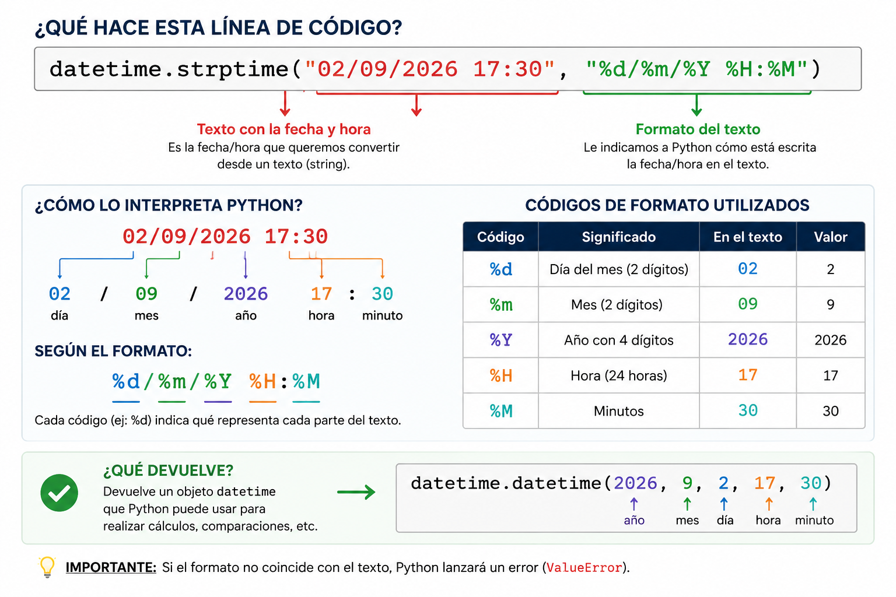

<!-- _class: title -->
<!-- _paginate: false -->

# 19. Fechas y horas en Python

## `datetime`, validacion y procesamiento de datos

<div class="course">
Programación I<br>
Ingeniería Electrónica y Telecomunicaciones
</div>

<div class="meta">
Comisión 3<br>
Profesor: Lautaro Linquimán<br>
Universidad Nacional de Río Negro
</div>

<div class="unrn-logo">
  
  <span>UNIVERSIDAD<br>NACIONAL</span>
</div>

---

<!-- _class: inverse -->

# Repaso express <br>Clase anterior

1. ¿Por que conviene hacer `git pull` antes de empezar a trabajar?
2. ¿Que pasa cuando dos personas modifican el mismo bloque de un archivo?

---

<!-- _class: compact -->

# Una herramienta para interpretar fechas

La mayoria de los lenguajes trae herramientas para trabajar con fechas.

En Python usamos `datetime` para representar fechas y horas como datos con significado.

Cuando una fecha llega desde `input()` o desde un archivo, normalmente llega como texto. Antes de validarla o compararla, necesitamos interpretarla.

```python
fecha = "01/09/2026 18:30"

print(fecha)
print(type(fecha))  # <class 'str'>
```

---

# ¿Para que sirve convertirla?

Cuando una fecha pasa de `str` a `datetime`, Python puede ayudarnos a:

- validar si existe;
- compararla con otra fecha;
- sumarle dias;
- calcular diferencias;
- mostrarla con otro formato.

---

# La idea central

```text
texto  →  datetime  →  texto
```

En los programas, una fecha suele llegar desde:

- `input()`;
- un archivo `.txt`;
- un archivo `.csv`;
- un `.json`;
- argumentos de terminal.

Para manipular fechas con precisión necesitamos convertirla a datetime.

---

<!-- _footer: "[Codigo Facilito: fechas con Python](https://codigofacilito.com/articulos/fechas-python)" -->

# Importar `datetime`

```python
from datetime import datetime

ahora = datetime.now()

print(ahora)
print(type(ahora))
```

`datetime.now()` crea un objeto con la fecha y hora actuales.

---

<!-- _class: compact -->

# Partes de una fecha

```python
from datetime import datetime

ahora = datetime.now()

print(ahora.year)
print(ahora.month)
print(ahora.day)
print(ahora.hour)
print(ahora.minute)
print(ahora.second)
print(ahora.microsecond)
```

---

# Creando una fecha manualmente

```python
from datetime import datetime

fecha = datetime(2026, 9, 2, 17, 30)

print(fecha)
print(fecha.day)
print(fecha.hour)
```

Orden de los valores:

```text
año, mes, dia, hora, minuto
```

---

<!-- _class: compact -->
<!-- _footer: "[freeCodeCamp: modulo datetime](https://www.freecodecamp.org/espanol/news/modulo-datetime-de-python-como-manejar-fechas-en-python/)" -->

# Extrayendo fecha de un string: `strptime`

```python
from datetime import datetime

texto = "02/09/2026 17:30"
fecha = datetime.strptime(texto, "%d/%m/%Y %H:%M")

print(fecha)
print(type(fecha))
```

`strptime()` necesita dos cosas:

1. Un texto en formato fecha;
2. el formato que explica como leerlo.

---

<!-- _class: compact -->

# Interpretando el formato

<div class="center">



</div>

---

<!-- _class: compact -->

# Codigos de formato

Lo importante es entender el patron:

```text
texto real:  02/09/2026 17:30
formato:     %d/%m/%Y %H:%M
```

Los simbolos `/`, `-`, `:`, espacios o letras tambien son relevantes para la extracción de la fecha.

El formato debe coincidir con el texto.

En el siguiente link se encuentra la tabla completa de formatos: [https://docs.python.org/es/3/library/datetime.html#strftime-and-strptime-format-codes](https://docs.python.org/es/3/library/datetime.html#strftime-and-strptime-format-codes)

---

<!-- _class: compact -->

# Otro formato posible

```python
from datetime import datetime

fecha = datetime.strptime(
    "2026-09-01T18:30:15",
    "%Y-%m-%dT%H:%M:%S"
)

print(fecha)
```

La `T` no es un codigo especial.

Es un caracter que tambien tiene que aparecer en el formato.

---

<!-- _class: compact -->

# Validando fechas con `strptime()`

```python
from datetime import datetime

fecha = datetime.strptime("33/01/2026", "%d/%m/%Y")

fecha = datetime.strptime("31/04/2026", "%d/%m/%Y")
```

Ambas producen `ValueError`.

Fallan porque esas fechas no existen en el calendario:

- febrero no tiene 31 dias;
- abril no tiene 31 dias.

---

<!-- _class: compact -->

# Validando fechas con `try` / `except`

```python
from datetime import datetime

texto = input("Fecha: ")

try:
    fecha = datetime.strptime(texto, "%d/%m/%Y")
    print("Fecha valida")
except ValueError:
    print("Fecha invalida")
```

Mecanismo similar al que podriamos utilizar con `int()`, `float()` o archivos.


---

<!-- _class: compact -->

# Ejercicio 1: formatos personalizados

Convertir cada texto a un objeto `datetime`.

```python
fechas = [
    "21-08-2026 18:45:20",
    "2026/08/21 07:30",
    "21.08.2026",
]
```

Para cada caso:

- mirar donde estan el dia, el mes y el año;
- identificar separadores;
- escribir el formato correcto.

---

<!-- _class: compact -->

# `strftime`: `datetime` a texto

```python
from datetime import datetime

fecha = datetime(2026, 9, 2, 17, 30)

print(fecha.strftime("%d/%m/%Y"))
print(fecha.strftime("%d/%m/%Y %H:%M"))
```

`strftime()` sirve para decidir como mostrar o guardar una fecha.

---

# strptime vs strftime

```text
strptime  →  texto a datetime

strftime  →  datetime a texto
```

Regla memotecnica:

- `p` de parsear;
- `f` de formatear.

Se usa `strptime()` cuando leemos datos.

Se usa `strftime()` cuando preparamos una salida.

---

<!-- _class: compact -->

# Ejercicio 2: cambiar el formato

Entrada:

```text
2026-09-15T18:25:30
```

Salida esperada:

```text
15/09/2026 18:25
```

<!-- Usar dos pasos:

1. `strptime()` para convertir el texto a `datetime`;
2. `strftime()` para generar el texto final. -->

---

<!-- _class: compact -->

# Comparando fechas

```python
from datetime import datetime

fecha_1 = datetime.strptime("01/09/2026 08:15", "%d/%m/%Y %H:%M")
fecha_2 = datetime.strptime("01/09/2026 10:30", "%d/%m/%Y %H:%M")

if fecha_1 < fecha_2:
    print("La primera fecha ocurre antes")
elif fecha_1 > fecha_2:
    print("La segunda fecha ocurre antes")
else:
    print("Las fechas son iguales")
```

Con objetos `datetime`, las comparaciones funcionan de forma natural.

---

<!-- _class: compact -->

# Operaciones con fechas: `timedelta`

```python
from datetime import datetime, timedelta

fecha = datetime(2026, 9, 2, 17, 30)
vencimiento = fecha + timedelta(days=7)

print(vencimiento)
```

`timedelta` representa una duracion.

Sirve para sumar o restar dias, horas, minutos o segundos.

---

<!-- _class: compact -->

# Diferencia entre fechas

```python
from datetime import datetime

fecha_1 = datetime(2026, 9, 1, 8, 15)
fecha_2 = datetime(2026, 9, 4, 10, 30)

diferencia = fecha_2 - fecha_1

print(diferencia)
print(diferencia.days)
```

Restar dos fechas devuelve una duracion.

---

<!-- _class: compact -->

# Ejercicio 3: registros de sensores

Procesar registros de sensores:

```python
registros = [
    "SENSOR_A;2026-09-01T08:15:00;3.2",
    "SENSOR_B;2026-09-01T10:30:00;4.1",
    "SENSOR_C;2026-02-30T12:00:00;5.3",
]
```

Cada registro tiene:

```text
sensor;fecha;valor
```

---

<!-- _class: compact -->

# Ejercicio 3: consigna

Para cada registro:

1. obtener el sensor, la fecha y el valor;
2. validar la fecha del registro;
3. continuar procesando los demas registros si aparece una fecha invalida;
4. mostrar las fechas validas como `DD/MM/YYYY HH:MM`.

Formato de entrada:

```python
"%Y-%m-%dT%H:%M:%S"
```

Formato de salida:

```python
"%d/%m/%Y %H:%M"
```

---

<!-- _class: compact inverse -->

# Cierre

```text
datetime.now()  → obtener fecha y hora actual

strptime()      → str a datetime

strftime()      → datetime a str

timedelta       → operar con tiempos

ValueError      → detectar fechas invalidas
```

Mientras una fecha sea un string, Python solamente ve texto.

Cuando la transformamos a `datetime`, podemos interpretarla, validarla, compararla y operar con ella.

---

<!-- _class: compact -->

# ANEXO 1

## Años bisiestos

```python
from datetime import datetime

datetime.strptime("29/02/2024", "%d/%m/%Y")  # valido
datetime.strptime("29/02/2025", "%d/%m/%Y")  # ValueError
```

`datetime` ya considera los años bisiestos al validar fechas.

```python
import calendar

print(calendar.isleap(2024))  # True
print(calendar.isleap(2025))  # False
```

No necesitamos aprender `calendar` para usar `datetime`.
