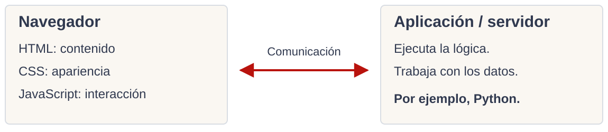
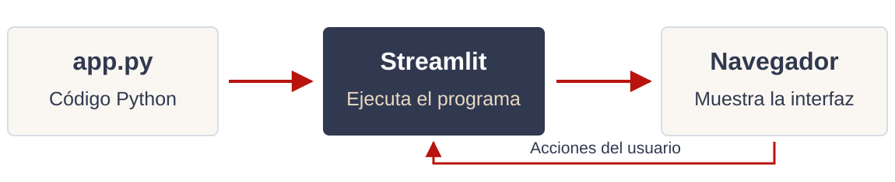

<!-- _class: title -->
<!-- _paginate: false -->

# 24. Streamlit desde cero

## Una interfaz web para nuestros programas en Python

<div class="course">
Programación I<br>
Ingeniería Electrónica y Telecomunicaciones
</div>

<div class="meta">
Comisión 3<br>
Profesor: Lautaro Linquimán<br>
Universidad Nacional de Río Negro
</div>

<div class="unrn-logo">
  
  <span>UNIVERSIDAD<br>NACIONAL</span>
</div>

---

<!-- _class: inverse -->

# Repaso express

1. ¿Cuándo elegirían un gráfico de barras y cuándo uno de líneas?
2. ¿Para qué sirven las etiquetas de los ejes y la leyenda?
3. ¿Cómo guardamos un gráfico de Matplotlib en un archivo PNG?

---

# Interfaces de usuario

La **interfaz** es la parte del programa con la que interactuamos: permite ingresar información, dar instrucciones y consultar resultados.

| Interfaz | Cómo interactuamos | Ejemplo |
|---|---|---|
| CLI: línea de comandos | Escribimos en una terminal y leemos texto. | Nuestros scripts con `input()` y `print()` |
| GUI: interfaz gráfica | Usamos ventanas, botones y otros controles. | Una calculadora de escritorio |
| Web UI: interfaz web | Usamos una interfaz desde el navegador. | Un formulario en una página web |

---

<!-- _class: compact -->

# Un programa, distintas interfaces

<div class="columns">
<div>

## En la terminal

```python
nombre = input("Nombre: ")
print("Hola", nombre)
```

El programa espera el texto y después muestra el saludo.

</div>
<div>

## En una interfaz gráfica

El nombre se escribe en un campo de texto. El saludo aparece en la misma ventana o página.

La tarea sigue siendo tomar un nombre y construir un saludo.

</div>
</div>

La **lógica** trabaja con los valores. La **interfaz** define cómo los ingresamos y cómo vemos el resultado.

---

# Funcionamiento de una aplicación web

<div class="columns">
<div>

El navegador presenta la página y recibe las acciones del usuario. El servidor ejecuta la lógica y devuelve resultados.

Python puede trabajar del lado del servidor con herramientas como Flask, Django o FastAPI.

</div>
<div>



</div>
</div>

---

<!-- _class: compact -->

# Qué es Streamlit

**Streamlit permite construir una Web UI interactiva escribiendo principalmente Python.** Se ocupa de conectar nuestro programa con los controles y resultados que aparecen en el navegador.

En esta materia nos permite agregar una interfaz a código que ya sabemos escribir.

También existen otras herramientas, con distintos usos:

| Tipo de aplicación | Algunas alternativas |
|---|---|
| Interfaces de escritorio | Tkinter, PySide |
| Aplicaciones web generales | Flask, Django |
| Interfaces y aplicaciones interactivas | Dash, Gradio |

---

# Usos habituales de streamlit

Streamlit se usa sobre todo para crear **aplicaciones de datos**: una interfaz para explorar información o probar cálculos escritos en Python.

- **Reportes interactivos:** filtrar datos y ver cómo cambian las tablas y los gráficos.
- **Herramientas de cálculo:** ingresar valores y consultar resultados sin editar el código.
- **Prototipos:** compartir una primera versión de una herramienta para que otras personas la prueben.

Por ejemplo, un cálculo de autonomía de una batería puede convertirse en una aplicación donde se ingresen la capacidad y el consumo esperado.

---

# Cómo funciona Streamlit



El navegador **no ejecuta directamente nuestro Python**. Streamlit ejecuta el archivo y construye la interfaz que vemos.

Al trabajar localmente, el programa y el navegador están en nuestra computadora, pero cumplen tareas distintas.

---

<!-- _class: compact -->

# Instalación y ejecución

Desde la raíz del repositorio, abrir una terminal en la carpeta de práctica:

```bash
pip install streamlit
```

Crear `app.py` guardado en esa carpeta, iniciar la aplicación con `streamlit run app.py`.

Streamlit inicia un **servidor local** y muestra una dirección, normalmente `http://localhost:8501`. La app se usa desde el navegador.

El proceso queda activo en esa terminal. Para detenerlo: **Ctrl + C**.

---

# Nuestra primera aplicación

El archivo `app.py` de los recursos contiene:

```python
import streamlit as st

st.title("Mi primera aplicación")
st.write("Hola desde Streamlit")
```

Al ejecutar `streamlit run app.py`, el título y el texto aparecen en el navegador.

Para probar los siguientes ejemplos, reemplazá el contenido de `app.py`, guardá los cambios y aceptá **Rerun** si aparece en el navegador.

---

<!-- _class: compact -->

# Salidas: terminal y navegador

```python
import streamlit as st

print("El programa llegó hasta acá")
st.write("Este mensaje se ve en la página")
```

<div class="columns">
<div>

## Terminal

`print()` escribe donde corre Python. Sirve para inspeccionar valores y seguir lo que hace el programa.

</div>
<div>

## Navegador

`st.write()` agrega contenido a la interfaz web, donde lo ve quien usa la aplicación.

</div>
</div>

Podemos usar ambas salidas en el mismo programa.

---

<!-- _class: compact -->

# Metodos para mostrar información

<div class="columns">
<div>

```python
import streamlit as st

st.title("Biblioteca")
st.header("Avisos")
st.write("Hoy abre a las 9.")
st.markdown("**Traé tu credencial.**")
```

</div>
<div>

- `st.title()`: título principal.
- `st.header()`: encabezado de una sección.
- `st.write()`: texto o valores.
- `st.markdown()`: texto con formato; por ejemplo, `**negrita**`.

</div>
</div>

En este ejemplo, cada llamada agrega un elemento debajo del anterior, en el orden en que se ejecuta el código.

---

<!-- _class: compact -->

# Metodos para obtener información

Los **widgets** son controles que devuelven valores Python para guardar en variables.

<div class="columns">
<div>

```python
import streamlit as st

nombre = st.text_input("Nombre")
descripcion = st.text_area("Descripción")
unidades = st.number_input("Unidades", 1)
color = st.selectbox("Color", ["Rojo", "Azul"])
urgente = st.checkbox("Es urgente")

st.write(nombre)
st.write(descripcion)
```

</div>
<div>

| Variable | Valor inicial | Tipo |
|---|---|---|
| `nombre` | `""` | `str` |
| `descripcion` | `""` | `str` |
| `unidades` | `1` | `int` |
| `color` | `"Rojo"` | `str` |
| `urgente` | `False` | `bool` |

</div>
</div>

`text_input()` recibe una línea; `text_area()`, varias. Ambos devuelven un `str`; `text_area()` sirve para textos largos.

---

<!-- _class: compact -->

# Botones y acciones

```python
import streamlit as st

nombre = st.text_input("Nombre", value="Luz")
if st.button("Saludar"):
    st.write("Hola", nombre)
```

`st.button()` devuelve un booleano: vale **`True` en la ejecución que provoca el clic**. Por eso podemos usarlo directamente como condición del `if`.

El bloque muestra el saludo solamente cuando presionamos el botón. Si después cambiamos el nombre, el botón devuelve `False` y el saludo desaparece.

El botón sirve para decidir cuándo realizar una acción, como guardar un archivo.

---

<!-- _class: compact -->

# La reejecución: rerun

En los ejemplos que estamos usando, al cambiar el valor de un widget, Streamlit **vuelve a ejecutar el script de arriba hacia abajo**.

```python
import streamlit as st

print("Ejecutando app.py")
unidades = st.number_input("Unidades", min_value=1)
st.write("Unidades elegidas:", unidades)
```

Cada cambio confirmado agrega otra línea en la **terminal**. En el navegador, la página se actualiza con el valor actual del widget.

En una entrada de una línea, como `text_input()`, el cambio se confirma con **Enter** o al salir del campo; no con cada letra.

---

# Variables entre ejecuciones

Las variables comunes se vuelven a asignar al ejecutar sus líneas. Si escribimos `contador = 0` al principio del archivo, cada rerun vuelve a ponerlo en cero.

Streamlit conserva los valores de los widgets que seguimos mostrando, pero eso **no conserva automáticamente cualquier variable** de nuestro programa.

Para recordar otra información entre ejecuciones de una misma sesión existe `st.session_state`. Su uso queda fuera del alcance de esta clase.

Un archivo que guardamos en el disco sí permanece aunque el script vuelva a ejecutarse.

---

<!-- _class: compact -->

# Ejercicio 1: editor de texto

Crear `editor.py`: una aplicación para escribir y guardar una nota.

1. Pedir el nombre del archivo. por ejemplo, `nota.txt`.
2. Pedir el contenido multilinea.
3. Agregar un botón **Guardar**. Al presionarlo, comprobar que el nombre y el contenido no estén vacíos.
4. Si falta alguno, mostrar un aviso. Si ambos están completos, guardar el contenido en el archivo `.txt` e informar que se guardó.

Ejecutar con `streamlit run editor.py`. Usar un nombre terminado en `.txt` y sin carpetas.

> El archivo se guarda en la carpeta desde la que iniciamos Streamlit.

---

# Mostrar valores y estructuras

`st.write()` también puede mostrar objetos de Python sin convertirlos manualmente a texto.

```python
import streamlit as st

st.write(42)
st.write(["Resistencia", "LED", "Pulsador"])
st.write({"componente": "LED", "cantidad": 12})
```

La presentación se adapta al tipo de dato: un número se ve como un valor y las listas o diccionarios permiten explorar su contenido.

Los objetos siguen siendo números, listas o diccionarios dentro del programa.

---

<!-- _class: compact -->

# Mostrar un DataFrame

<div class="columns">
<div>

```python
import pandas as pd
import streamlit as st

df = pd.DataFrame({
    "componente": ["LED", "Pulsador"],
    "cantidad": [12, 8]
})

print(df)
st.write(df)
st.dataframe(df)
```

</div>
<div>

`print(df)` muestra una tabla de texto en la terminal.

`st.write(df)` reconoce el DataFrame y lo presenta como una tabla en la web.

`st.dataframe(df)` pide explícitamente esa vista tabular: permite recorrer la tabla y ordenar columnas desde la interfaz.

</div>
</div>

Para este ejemplo, instalar también Pandas en el entorno: `pip install pandas`.

---

<!-- _class: compact -->

# Mensajes para el usuario

Podemos distinguir información, advertencias, errores y confirmaciones:

```python
import streamlit as st

st.info("El catálogo se actualiza cada semana.")
st.warning("Quedan pocas unidades disponibles.")
st.error("No se pudo abrir el archivo.")
st.success("La reserva quedó registrada.")
```

Son ejemplos de situaciones distintas. En una app mostramos el mensaje que corresponda a lo que ocurrió.

Estos bloques hacen más claro el estado de la aplicación que un texto genérico con `st.write()`.

---

<!-- _class: compact -->

# Mostrar una imagen

```python
import streamlit as st

st.image(
    "recursos/sixseven.png",
    caption="Sixseven sixseven"
)
```

`st.image()` lee una imagen existente y la presenta en la página. La ruta relativa se interpreta desde la carpeta donde iniciamos Streamlit.

También puede mostrar un PNG que nuestro programa haya guardado con Matplotlib: el archivo debe existir antes de llamar a `st.image()`.

---

<!-- _class: compact -->

# Streamlit tiene mucho más

<div class="columns">
<div>

## Interacción y presentación

- Formularios, carga y descarga de archivos.
- Sidebar, columns, tabs y container.
- Aplicaciones multipágina y componentes.

</div>
<div>

## Otras posibilidades

- Caché y uso avanzado de Session State.
- Multimedia, mapas y publicación de aplicaciones (*deployment*).
- Métricas y gráficos propios de Streamlit.

</div>
</div>


La [API Reference oficial](https://docs.streamlit.io/develop/api-reference) está organizada por categorías. Ahí podemos buscar un componente, consultar qué parámetros acepta y ver ejemplos de uso.

---

<!-- _class: compact -->

# Ejercicio 2: explorar episodios

Crear `episodios.py`, una app para consultar episodios de Los Simpson por temporada.

Usar [SimpsonsData_es.csv](../../clase-22/SimpsonsData_es.csv), de la clase 22. Cada fila es un episodio; `Season` es la temporada y `Title`, el título.

La aplicación debe:

1. Cargar el CSV con Pandas y obtener las temporadas disponibles, sin repetirlas.
2. Permitir elegir una temporada desde la interfaz.
3. Filtrar los episodios que pertenecen a la temporada elegida.
4. Indicar cuántos encontró y mostrar el resultado con `st.dataframe()`.

Al elegir otra temporada, el conteo y la tabla deben actualizarse juntos.

Una pista para obtener las temporadas sin repetirlas: `temporadas = df["Season"].unique()`
