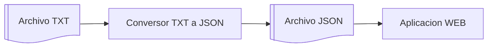
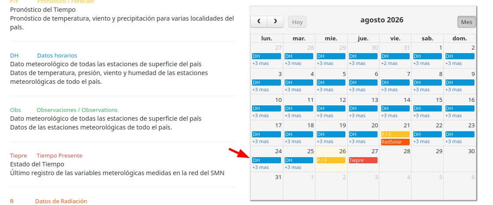

# Trabajo Práctico Integrador 1 - Parte 1
## Conversor de archivos: TXT del SMN a JSON

## Proyecto completo

En este trabajo integrador van a construir un flujo completo de procesamiento de datos meteorológicos:



La Parte 1 construye el conversor de TXT a JSON. La Parte 2 construye una app web que carga ese JSON para filtrar datos, calcular estadísticas y mostrar tablas o gráficos. La app web no debe volver a interpretar el TXT: la limpieza inicial de los datos queda resuelta en esta parte.

## Objetivo Parte 1

Construir una aplicación de línea de comandos que lea un archivo TXT del Servicio Meteorológico Nacional, interprete sus registros, separe registros válidos e inválidos y genere un archivo JSON para usar en la Parte 2.

El desafío está en decidir cómo parsear cada línea, cómo representar los datos, cómo informar errores y cómo organizar el JSON final. No se agregan librerías externas.

## Formato de entrada

Los datos salen de archivos públicos del Servicio Meteorológico Nacional:

<https://www.smn.gob.ar/descarga-de-datos>



Formato general:

```text
FECHA     HORA  TEMP   HUM   PNM    DD    FF     NOMBRE
         [HOA]  [°C]   [%]  [hPa]  [gr] [km/hr]
01082026     0  19.5   94  1004.3  250   13     AEROPARQUE AERO
```

El nombre de la estación puede tener más de una palabra. El archivo puede incluir encabezados, líneas vacías y registros incompletos o inválidos.


## Comando esperado

```bash
python adaptar_datos.py datos/observaciones.txt datos/observaciones.json
```

## Requerimientos

El programa debe:

- recibir por argumento la ruta del TXT de entrada y la ruta del JSON de salida;
- recorrer el TXT completo, ignorar encabezados y líneas vacías, y validar cada registro sin detenerse ante el primer error;
- separar los registros válidos de los inválidos, guardando en los inválidos la línea original y una explicación breve del error;
- generar un JSON válido, con una estructura definida y documentada. El json debe contener:
    - Información general del procesamiento: 
        - cantidad de registros
        - cantidad de registros validos
        - cantidad de registros invalidos.
    - Registros válidos
    - Registros invalidos con su linea original.
- mostrar al finalizar el programa un resumen con cantidades leídas, válidas e inválidas;
- manejar errores de argumentos, lectura y escritura con mensajes claros;
- dividir el programa en funciones y al menos dos módulos: programa principal y módulo de validaciones.

## Documentación

El proyecto debe incluir un `README.md` con una descripción breve, instrucciones de instalación o preparación, comandos de ejecución, explicación de los archivos de entrada y salida, y documentación del formato del JSON generado.

## Validaciones mínimas

- La fecha debe existir, tener el formato esperado y representar una fecha posible.
- La hora debe ser numérica y estar dentro del rango válido.
- Temperatura, humedad, presión, dirección y velocidad del viento deben poder convertirse a número cuando correspondan.
- La humedad debe estar entre 0 y 100.
- La dirección del viento debe estar entre 0 y 360.
- La velocidad del viento no puede ser negativa.
- La estación no puede quedar vacía.

## Entregables

### Primera entrega: lunes 31/08/2026

- `README.md` con información básica del proyecto, grupo, participantes y forma de ejecución prevista.
- Documentación de la estructura de JSON de salida elegida por el grupo.
- Implementación inicial del parseo del TXT recibido por argumento de línea de comandos.
- Implementación inicial del módulo de validaciones.

### Segunda entrega: lunes 14/09/2026

- Escritura del archivo JSON, tomando el nombre del archivo de salida desde `sys.argv`.
- Validaciones completas del archivo de entrada.
- Separación completa de registros válidos e inválidos.
- Manejo de errores de argumentos, lectura y escritura.
- `README.md` completo, con instalación o preparación, comandos de ejecución, archivos de entrada y salida, y formato del JSON generado.
- Ejecución demostrable de punta a punta: TXT de entrada, JSON generado y resumen final por consola.

## Prolijidad de la entrega

La entrega debe estar ordenada: archivos con nombres claros, carpetas simples, sin archivos duplicados o que no se usen, y con instrucciones suficientes para ejecutar el proyecto desde cero.

## Clases relevantes

- [Clase 5 - Funciones y módulos](../clases/clase-05/): división del programa en funciones y módulos.
- [Clase 10 - Archivos](../clases/clase-10/): lectura y escritura de archivos de texto.
- [Clase 11 - Validación y manipulación de datos](../clases/clase-11/): validaciones sobre entradas y estructuras.
- [Clase 15 - Terminal y argumentos](../clases/clase-15/): uso de `sys.argv` y rutas recibidas por consola.
- [Clase 16 - JSON en Python](../clases/clase-16/): escritura del archivo JSON con `json.dump()`.
- [Clase 17 - Manejo básico de excepciones](../clases/clase-17/): manejo de errores de argumentos, lectura y escritura.
- [Clase 19 - Fechas y horas con `datetime`](../clases/clase-19/): validación de fechas del archivo del SMN.